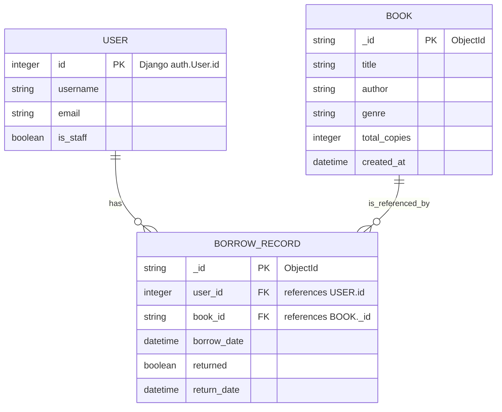

# Library Management System — Django + MongoDB

This web application provides basic library management features, enabling users to borrow and return books while administrators can manage the catalog. The system utilizes Django authentication and MongoDB for storing book and borrow record data.

---

## 📌 Features Overview

* Secure user registration and login
* Role-based access: User and Admin
* Admin can add, edit, and delete books
* Users can view catalog, borrow and return books
* Borrow records tracking book availability

---

## 🔧 Project Setup & Installation (Windows PowerShell)

1️⃣ Create and activate a Python virtual environment

```powershell
python -m venv venv
.\venv\Scripts\Activate.ps1
```

2️⃣ Install required dependencies

```powershell
pip install -r requirements.txt
```

3️⃣ Set MongoDB connection environment variable

```powershell
$env:MONGODB_URI = 'your-atlas-or-local-mongodb-uri'
```

4️⃣ Apply migrations for Django authentication

```powershell
python manage.py migrate
```

5️⃣ Run development server

```powershell
python manage.py runserver
```

Visit → [http://127.0.0.1:8000/](http://127.0.0.1:8000/)

---

## 🏗️ Technologies Used — and Why

| Technology           | Purpose                             | Rationale                                                   |
| -------------------- | ----------------------------------- | ----------------------------------------------------------- |
| **Django**           | Authentication, routing, admin UI   | Provides robust security, built-in user and role management |
| **MongoDB**          | Book and borrow record storage      | Handles flexible, document-based catalog data efficiently   |
| **MongoEngine**      | ODM for interacting with MongoDB    | Django-like API makes integration easier                    |
| **SQLite (default)** | Stores Django auth and session data | Simplifies development setup                                |

This hybrid approach leverages relational data integrity for users and flexible storage for book data.

---

## 🛠️ ER Diagram



---

## 🌐 API Endpoints (Functional Routes)

| Method   | Route                 | Purpose                  | Role          |
| -------- | --------------------- | ------------------------ | ------------- |
| GET      | `/`                   | View catalog             | User / Admin  |
| GET      | `/book/<id>/`         | Show book details        | User / Admin  |
| POST     | `/books/<id>/borrow/` | Borrow a book            | User          |
| POST     | `/books/<id>/return/` | Return a borrowed book   | User          |
| GET/POST | `/register/`          | User registration        | Public        |
| GET/POST | `/login/`             | User authentication      | Public        |
| POST     | `/logout/`            | Logout                   | Authenticated |
| GET/POST | `/books/add/`         | Add new book             | Admin         |
| GET/POST | `/books/<id>/edit/`   | Edit book                | Admin         |
| POST     | `/books/<id>/delete/` | Delete book              | Admin         |
| GET      | `/my-borrows/`        | List user borrow records | User          |

---

## 🚀 Working Project DEMO

🔗 DEMO YOUTUBE Video: `https://youtu.be/D1x91OKxx2U`

🔗 Deployment Link: Still working
