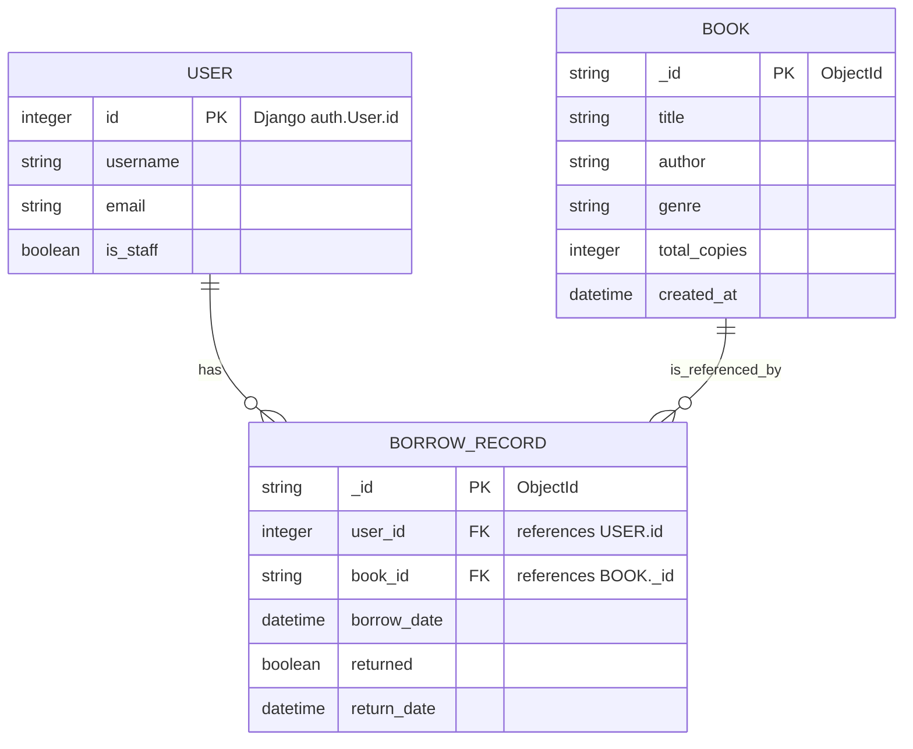

# Library Management (Django)

This is a minimal Django app implementing a simple library management system.
Features:
- User registration and login. During registration user can choose role: User or Admin. Admins are created with staff status.
- Admins can add / edit / delete books.
- Users can view catalog, borrow available books, return borrowed books, and view current borrows.
- Book availability is tracked using borrow records.

Quick start (Windows PowerShell):

1. Create a Python virtual environment and activate it:

```powershell

# Library Management (Django + MongoDB)

A simple personal library management web application built with Django.

Summary
- Users can register/login (roles: User, Admin).
- Admins can create, edit and delete books.
- Users can view catalog, borrow and return books; borrow records track availability.
- Application uses MongoDB (via MongoEngine) for books and borrow records; Django's relational DB (SQLite by default) is used for authentication and sessions.

Contents
- Project setup and installation
- Technologies used and rationale
- ER diagram (text)
- API endpoints (method, route, purpose)

## Project setup & installation (Windows PowerShell)

1) Create and activate a Python 3.12 virtual environment (example):

```powershell
python3.12 -m venv venv312
.\venv312\Scripts\Activate.ps1
```

2) Install project dependencies:

```powershell
pip install -r requirements.txt
```

3) Configure MongoDB connection:
- Option A (recommended for local dev): run a local MongoDB or Atlas and set `MONGODB_URI`.

PowerShell example (Atlas):

```powershell
$env:MONGODB_URI = 'mongodb+srv://<user>:<pass>@cluster0.mongodb.net/<dbname>?retryWrites=true&w=majority'
```

- Option B: place a single-line MongoDB connection string in `mongodb_uri.txt` in the project root (the project will read it if the env var isn't set).

4) Prepare Django relational database (auth/sessions):

```powershell
python manage.py makemigrations
python manage.py migrate
```

5) (Optional) Create demo data and/or superuser:

```powershell
python manage.py create_demo_data
python manage.py createsuperuser
```

6) Run the development server:

```powershell
python manage.py runserver
```

Open http://127.0.0.1:8000/ in your browser.

Notes
- The project ships with a `settings.py` configuration that keeps Django's primary `DATABASES` set to SQLite for auth and sessions. Application documents (books, borrows) live in MongoDB via MongoEngine.
- If you deploy to a read-only filesystem (serverless) you should move auth/session to managed Postgres and update `settings.py` accordingly.

## Technologies used and why

This project uses a small, pragmatic stack chosen to make local development fast while allowing a straightforward production migration path.

- Django (4.x)
	- Role: primary web framework, request routing, templating, forms, auth, and admin site.
	- Why: Django provides batteries-included functionality (auth system, admin, forms, CSRF protection) which significantly reduces boilerplate for user registration, login, and permission handling. The project relies on Django's proven security and session handling for authentication while delegating application document storage to MongoDB.
	- Production notes: keep Django upgrades compatible with other dependencies; consider using PostgreSQL in production for relational data (sessions, if you choose).

- MongoDB
	- Role: document database for application data (Book documents and BorrowRecord documents).
	- Why: book and borrow records have a relatively flexible, denormalized structure (e.g., optional metadata, changing fields). MongoDB simplifies storing these documents without rigid migrations and works well for read-heavy catalog operations. Using MongoDB decouples the operational model of app data from Django's relational models.
	- Production notes: use a managed provider (Atlas) or a highly-available replica set for production. Secure credentials and use TLS/SSL.

- MongoEngine
	- Role: Python ODM used to define Book and BorrowRecord documents and query MongoDB from Django views and management commands.
	- Why: MongoEngine provides a declarative, model-like API similar to Django models, making the codebase easier to read and maintain for developers familiar with Django's ORM. It also handles connection management and integrates cleanly with the project's management commands.
	- Tradeoffs: MongoEngine is an additional dependency and doesn't integrate with Django's migration system (which is fine for document stores). For advanced query / aggregation needs you may reach for PyMongo directly.

- SQLite (development relational DB)
	- Role: stores Django's auth, session and any other relational models used by Django core apps during local development.
	- Why: zero-configuration, file-based database that keeps the development setup simple and portable.
	- Production notes: SQLite is not suited for concurrent production workloads. For production use switch to PostgreSQL (or other managed SQL) and update `DATABASES` in `library_project/settings.py`.

- python-dotenv
	- Role: optional local development convenience to load environment variables from a `.env` file.
	- Why: makes it easier to test locally without repeatedly setting environment variables in the shell. The project will still prefer `MONGODB_URI` from the environment over a `.env` file.

- Other notable packages
	- pymongo: underlying MongoDB driver used by MongoEngine; required for direct admin/health checks and low-level operations.
	- gunicorn (optional for production): WSGI HTTP server for deploying Django in many Linux-based production environments.

If you'd like, I can expand this section further with a comparison table (pros/cons) for MongoDB vs PostgreSQL for this app or provide example connection/security settings for production.

## Note: models live both as Django models (migrated tables) and MongoEngine documents. Below is a Mermaid ER diagram representing the same entities and relationships.



Explanation:
- `USER` is the Django `auth.User` table (relational). Primary key: `id` (integer).
- `BOOK` and `BORROW_RECORD` are MongoDB documents (MongoEngine). Primary keys: `_id` (ObjectId).
- Relationships:
  - A single `USER` can have many `BORROW_RECORD`s (1..*).
  - A single `BOOK` can be referenced by many `BORROW_RECORD`s (1..*).


## API endpoints (high-level)
The project primarily serves HTML pages, but views correspond to logical routes you can call from forms or via REST-like requests.

- GET /                — Home / catalog view (list books, availability)
- GET /book/<id>/      — Book detail page (shows book info and borrow button)
- GET /books/add/      — Admin: add new book form
- POST /books/add/     — Admin: submit new book
- GET /books/<id>/edit/— Admin: edit book form
- POST /books/<id>/edit/ — Admin: submit edits
- POST /books/<id>/delete/ — Admin: delete book
- POST /books/<id>/borrow/ — User: borrow a book (creates BorrowRecord)
- POST /books/<id>/return/ — User: mark borrow as returned
- GET /my-borrows/     — User: view current borrows (and return links)
- GET /register/       — Registration form (creates auth.User)
- POST /register/      — Submit registration
- GET /login/          — Login form
- POST /login/         — Submit credentials
- POST /logout/        — Logout

## Management commands (useful)
- python manage.py create_demo_data — create sample books and demo users (if present)
- python manage.py migrate_sqlite_to_mongo — migrate existing Django `Book` and `BorrowRecord` rows from `db.sqlite3` into MongoDB documents

## Deploying to Render (step-by-step)
Below are two flows: a quick dev deploy (uses SQLite) and a recommended production flow (Postgres + MongoDB Atlas).

Prerequisites
- GitHub repo with this project pushed.
- Render account (https://dashboard.render.com).
- MongoDB Atlas URI (set in `MONGODB_URI` env var on Render) or accessible MongoDB.
- Recommended: create a Render PostgreSQL instance for production.

Quick dev deploy (fast, demo-only)
1. Ensure `requirements.txt` contains `gunicorn` and `whitenoise` (we include these in this repo).
2. Commit the repo and push to GitHub.
3. In Render dashboard: New -> Web Service -> Connect GitHub -> choose repo and branch.
4. Environment: Python 3.12. Build command:

```
pip install -r requirements.txt && python manage.py collectstatic --noinput
```

Start command:

```
gunicorn library_project.wsgi:application --bind 0.0.0.0:$PORT
```

5. Set the following Environment Variables in Render (Service -> Environment):
- SECRET_KEY (set a secure value)
- DEBUG = false
- MONGODB_URI = your Atlas URI (or leave empty to use local fallback)

6. Deploy. After the service starts open the Shell in Render and run:

```
python manage.py migrate
python manage.py create_demo_data
python manage.py createsuperuser
```

Recommended production deploy
1. Create a managed PostgreSQL database in Render (Render -> New -> PostgreSQL). Note the `DATABASE_URL` provided by Render.
2. In your Render service settings set `DATABASE_URL` (Render usually provides this automatically when you attach the DB), set `MONGODB_URI` (Atlas), `SECRET_KEY`, and `DEBUG=false`.
3. Build and start commands same as quick deploy. Ensure `requirements.txt` includes `psycopg2-binary` and `dj-database-url` (present in this repo).
4. After deployment run:

```
python manage.py migrate
python manage.py collectstatic --noinput
python manage.py create_demo_data
python manage.py createsuperuser
```

Using `render.yaml`
You can import the provided `render.yaml` file when creating services on Render. Edit `render.yaml` and replace the `repo` URL and fill in env var defaults or leave them blank and set them via the Render dashboard.

Troubleshooting
- If you see errors about `djongo` or database backend: remove `djongo` from `requirements.txt` (already removed) and ensure `DATABASE_URL` is set correctly.
- If static files 404: confirm `collectstatic` ran during build and that `whitenoise.middleware.WhiteNoiseMiddleware` is in `MIDDLEWARE`.
- If MongoDB auth fails: verify `MONGODB_URI`, and temporarily allow access from Render's IPs in Atlas (or whitelist 0.0.0.0/0 for testing only).


